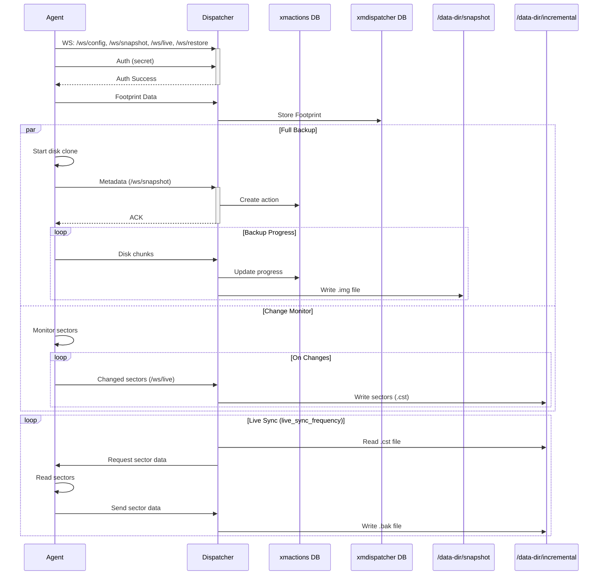
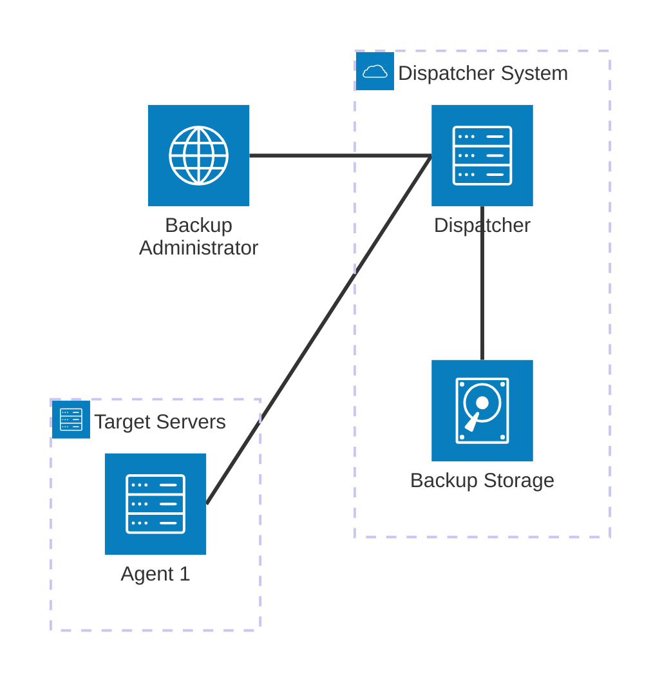

# Architecture
## Tech stack

We have chosen to use the following tech stack:

- Golang 1.23
- BoltDB
- eBPF

We only have one code base for the Agent, Dispatcher and the TUI application. And it's a single binary for all at the moment. BoltDB is used to store the status of various actions like clone, pause, resume, restore, etc., to store the metadata of the servers where agent is running and to keep track of the dirty sectors.

## Overview

The blxrep architecture establishes a robust, real-time connection between Agents and the Dispatcher through multiple WebSocket channels. This design enables both full disk backups and continuous incremental change tracking to operate simultaneously. When an Agent connects, it authenticates through a secure WebSocket connection and immediately begins two parallel processes: creating a complete disk image and monitoring disk sectors for changes.
During the full backup process, the Agent streams disk data to the Dispatcher, which stores it as an .img file in the snapshot directory while tracking progress in the xmactions database. Simultaneously, the Agent monitors disk sectors for changes, sending these sector numbers to the Dispatcher through a dedicated WebSocket channel. The Dispatcher preserves these sector changes as .cst files in the incremental directory.

At regular intervals defined by the live_sync_frequency, the Dispatcher reads the collected sector numbers and requests the corresponding data from the Agent. Upon receiving this data, the Dispatcher stores it in .bak files within the incremental directory, ensuring all changes are captured and preserved.

In the current implementation, if network connectivity between the Agent and Dispatcher is interrupted, the Agent initiates a new full disk snapshot upon reconnection. While this approach ensures data consistency, it's not optimized for network efficiency or storage resources. We are actively exploring more efficient approaches that would capture only the incremental changes that occurred during the network downtime, alongside the existing live change sector tracking mechanism.

This optimization would significantly reduce network bandwidth usage and backup time during reconnection scenarios. Instead of transferring the entire disk image again, the system would only need to synchronize the specific sectors that changed during the disconnection period. This enhancement would be particularly valuable in environments with unstable network connections or when dealing with large disk volumes.

The architecture utilizes four distinct WebSocket endpoints:

- /ws/config for configuration management
- /ws/snapshot for full disk backup operations
- /ws/live for real-time change tracking
- /ws/restore for data restoration processes

This separation of concerns allows for efficient handling of different types of operations while maintaining persistent connections between the Agent and Dispatcher. The combination of continuous change tracking and dedicated communication channels makes blxrep particularly effective for maintaining synchronized disk states across systems. The planned optimizations for handling network interruptions will further enhance the system's efficiency and reliability in real-world deployment scenarios.

## Deployment Architecture

Dispatcher is deployed in a different subnet or the datacenter than the target servers. The target servers can be connected to the dispatcher privately or publicly. The backup storage is a disk that is mounted to the dispatcher server where the backups are stored.
